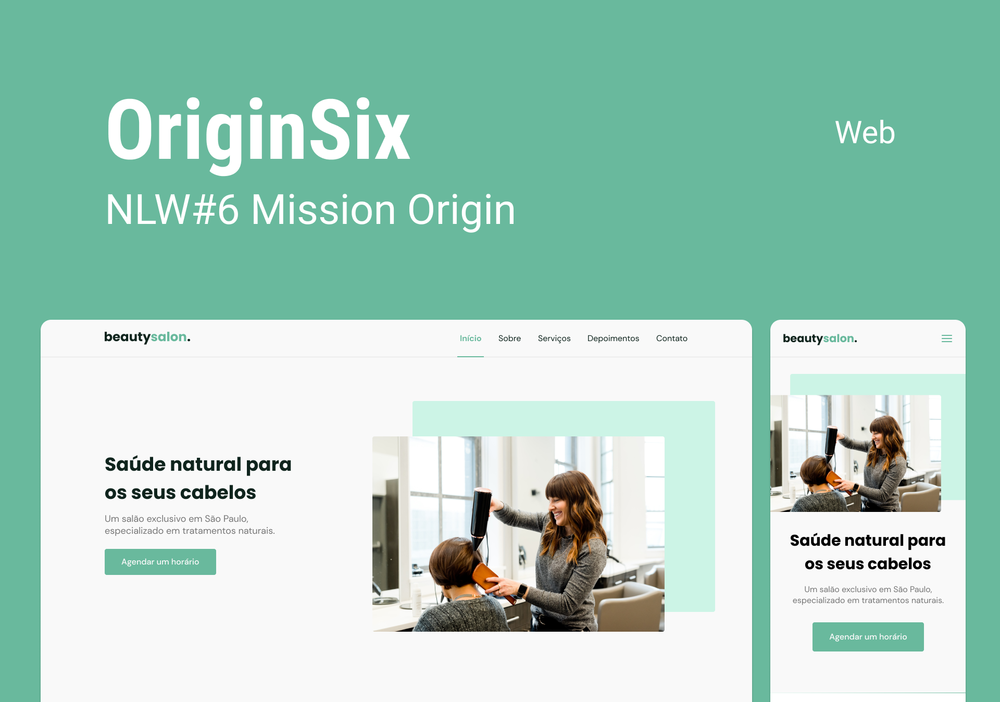

## 🖥️ Projeto 
Esse é um projeto Web Responsivo de uma página para salão de beleza.

## 🚀 Teconologias
Esse projeto foi desenvolvido durante o NLW da Rocketseat com as seguintes tecnologias:

-HTML
-CSS
-JavaScript
-Git e Github

## 🏷️ Layout
Você pode visualizar o layout do projeto através [desse link](https://www.figma.com/file/frqBrfaqFkwU9CQ28QbMCb/Origin-Six-(Community)?node-id=120%3A3&mode=dev).
É necessário ter uma conta no [Figma](https://www.figma.com)